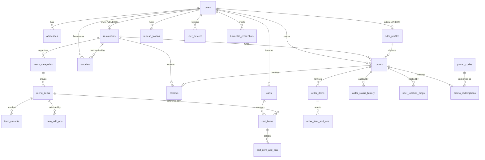

# CR Shop — Database Schema Design

**Step 2 deliverable.** Derived from `cr-shop-backend-api-specification.md` v1.0.0.
Target: PostgreSQL 15+ with PostGIS 3.3+. DDL lives in [`db/schema.sql`](../db/schema.sql);
the invariant harness lives in [`db/verify_constraints.sql`](../db/verify_constraints.sql).

**Verification status:** applied to PostgreSQL 16 / PostGIS 3.4 — all **21 invariant
assertions pass**. The geospatial discovery query was profiled against 50,002 seeded
restaurants and uses the GiST index (bitmap index scan, 0.035 ms; 4.7 ms end to end).

All six open decisions (D1–D6) were resolved on 2026-08-13 and are now implemented —
see §6.

| | |
|---|---|
| Application tables | 25 (10 `[SPEC]`, 15 `[EXTENDED]`) + 4 partitions |
| Indexes | 94 |
| Foreign keys | 51 |
| Check constraints | 36 |
| Enum types | 10 |

Measured against a live database built by `alembic upgrade head`, not counted by
hand. `alembic check` additionally confirms the ORM models in `app/models/`
carry no drift from this schema.

---

## 1. Design rules

1. **UUIDv4 primary keys** on every table except `rider_location_pings` (high-volume
   append-only, uses `bigint` identity) — spec §2 requires UUIDs to prevent enumeration.
2. **Money is `BIGINT` in paisa.** `item_total: 1059` in the API is `105900` in the column.
   Conversion happens at exactly one serializer boundary and never inside business logic.
3. **`lat`/`lng` are the source of truth**; `location geography(Point,4326)` is a
   `GENERATED ALWAYS ... STORED` column. The two cannot drift, and the GiST index rides on
   the generated column.
4. **Snapshot anything a user will see later.** Order line items, add-on names, and the
   delivery address are copied at purchase time. A vendor editing a price must never
   rewrite the history of a delivered order.
5. **Invariants belong in the database.** Where the spec describes a rule enforced by
   application code, it is expressed as a constraint instead. Application code then
   produces the *friendly* error for a case the database already refuses.

---

## 2. Entity-relationship overview



### Cardinality reference

| Relationship | Type | Enforcement |
|---|---|---|
| User → Address | 1:N | FK + `ON DELETE CASCADE` |
| User → Cart | **1:1** | surrogate `carts.id` PK + `UNIQUE(user_id)` (D5) |
| User(VENDOR) → Restaurant | **1:1** | `UNIQUE(owner_id)` — see decision **D1** |
| User(RIDER) → RiderProfile | 1:1 | shared PK |
| User ↔ Restaurant (favorites) | **N:M** | composite PK join table |
| Restaurant → MenuCategory → MenuItem | 1:N → 1:N | cascading FKs |
| MenuItem → ItemVariant / ItemAddOn | 1:N | cascade on item delete |
| Cart → CartItem | 1:N | composite FK, see §3 |
| CartItem ↔ ItemAddOn | **N:M** | `cart_item_add_ons` |
| Order → OrderItem | 1:N | cascade |
| OrderItem ↔ ItemAddOn | **N:M** | `order_item_add_ons`, snapshotted |
| Order → Review | 1:1 | `UNIQUE(order_id)` |
| PromoCode ↔ User ↔ Order | N:M ledger | `promo_redemptions` |

---

## 3. The two structural decisions worth explaining

### 3.1 Single-restaurant-per-cart, enforced for real

Spec §10 claims the rule is enforced "at the database level" by putting `restaurant_id` on
`Cart`. **It isn't.** That column stops a cart from *declaring* two restaurants, but nothing
stops `cart_items` from pointing at a menu item belonging to a different one. The rule
still lives entirely in application code, and one missed check leaks a corrupt cart.

The fix costs one denormalized column. `cart_items` carries `restaurant_id`, and that single
column is shared by two composite foreign keys:

```
(cart_id,      restaurant_id) ──→ carts(id, restaurant_id)
(menu_item_id, restaurant_id) ──→ menu_items(id, restaurant_id)
```

An item from another restaurant cannot satisfy both at once. Declaring the true
`restaurant_id` breaks the first FK; spoofing it to match the cart breaks the second.
Both attacks are in the verification harness and both are rejected. The `409 Conflict` the
spec asks for becomes a courteous message about something the database has already made
impossible.

The same trick chains further: `(variant_id, menu_item_id) → item_variants(id, menu_item_id)`
guarantees the chosen size actually belongs to the chosen dish.

### 3.2 Role guards via composite foreign keys

`users` carries `UNIQUE(id, role)`. Tables that require a specific role then carry a
constant-valued role column plus a composite FK:

```sql
owner_role user_role NOT NULL DEFAULT 'VENDOR' CHECK (owner_role = 'VENDOR'),
FOREIGN KEY (owner_id, owner_role) REFERENCES users(id, role)
```

A `CUSTOMER` row can no longer be written into `restaurants.owner_id` or
`orders.rider_id`, regardless of what the service layer does. This makes §7's permission
matrix a property of the data, not a convention. The trade-off: a user's role can no longer
be changed by a bare `UPDATE` while they own dependent rows — which is the correct
behaviour, but it does mean role changes need a deliberate migration path.

---

## 4. Index strategy

| Index | Type | Serves |
|---|---|---|
| `ix_restaurants_location` | **GiST** on geography | `GET /restaurants?lat=&lng=` via `ST_DWithin` + `<->` KNN ordering |
| `ix_addresses_location` | GiST | delivery-zone checks, fee calculation |
| *(no rider GiST index)* | — | **deliberate, see D2** — nearest-rider dispatch is served by Redis `GEOSEARCH` |
| `ix_restaurants_open_rating` | B-tree `(status, rating_avg DESC)` partial | `GET /home/feed` top-rated open stores |
| `ix_restaurants_name_trgm` | GIN trigram | `GET /search` fuzzy restaurant names |
| `ix_menu_items_search` | GIN tsvector | `GET /search` dish names + descriptions |
| `ix_restaurants_cuisines` | GIN on `text[]` | cuisine filter chips |
| `ix_orders_vendor_queue` | `(restaurant_id, status, placed_at DESC)` | `GET /vendor/orders` |
| `ix_orders_customer_history` | `(customer_id, placed_at DESC)` | `GET /orders?sort=-created_at` |
| `ix_orders_auto_decline` | partial `WHERE status='PENDING'` | the 60s auto-decline sweeper — index stays tiny because only unaccepted orders qualify |
| `ix_orders_analytics` | partial `WHERE status='DELIVERED'` | `GET /vendor/analytics` date ranges |
| `ix_rider_pings_time` | **BRIN** | append-only GPS history; kilobytes where a B-tree would cost gigabytes |
| `uq_addresses_one_default` | partial unique | one default address per user, race-proof |

**Measured:** on 50,002 restaurants, the 5 km discovery query plans as
`Bitmap Index Scan on ix_restaurants_location` — 0.035 ms in the index, 4.7 ms end to end
including distance refinement and sort.

---

## 5. What `[EXTENDED]` adds, and why

| Table | Why it must exist |
|---|---|
| `order_items` + `order_item_add_ons` | **The critical omission.** §6 gives orders totals but no line items. Without these, an order cannot say what was bought, and a menu price edit silently rewrites history. |
| `order_status_history` | Powers the `GET /orders/{id}/tracking` timeline; settles "who cancelled this" disputes. |
| `rider_profiles` | §6 defines a `RIDER` role, `orders.rider_id`, live GPS and rider earnings — but never models the rider. |
| `rider_location_pings` | Backing store for `WS /ws/orders/{id}/live-tracking`. See **D2**. |
| `reviews` | Endpoint #35 exists; no entity did. Also the only honest source for `restaurants.rating_avg`. |
| `favorites` | Endpoints #24–25. |
| `promo_codes` + `promo_redemptions` | `GET /checkout/summary?promo_code=` needs somewhere to validate against, and `per_user_limit` needs a ledger. |
| `otp_codes` | `/auth/otp/*` and `/auth/password/*` need hashed, expiring, replay-proof codes with attempt counters. |
| `refresh_tokens` | §1 mandates a refresh token; nothing modelled revocation or rotation. |
| `idempotency_keys` | §9's `Idempotency-Key` recommendation for `POST /orders`. |
| `user_devices` | §9's FCM requirement. |
| `biometric_credentials` | `POST /auth/biometrics/enable` as a bare boolean is security theater — verifying a signed challenge needs a stored per-device public key. |
| `cart_item_add_ons` | The N:M half of `add_on_ids: ["uuid"]` in the cart payload. |

---

## 6. Resolved decisions (D1–D6)

All six were ruled on 2026-08-13 and are implemented in `db/schema.sql`.

### D1 — One restaurant per vendor · **kept**
`UNIQUE(owner_id)` stays, matching the spec's singular `PATCH /vendor/store/status`.
The constraint was never the expensive half to reverse — a breaking API change for
already-shipped mobile clients is. So the hedge lives in code, and **Step 3/4 must honour
it**:
- vendor services resolve their restaurant through **one shared dependency**, never by
  querying `owner_id` inline;
- every vendor response carries `restaurant_id`, so clients already hold it.

Multi-outlet then costs one migration plus one dependency, not a rewrite.

### D2 — Rider GPS · **changed: Redis hot path + decimated Postgres trail**
The deciding factor was not write volume but index churn: a GiST index on
`rider_profiles.current_location` updated every 5 s per rider is a hot-row `UPDATE`, which
in Postgres means a dead tuple *and* an index entry per ping — roughly **8.6M dead tuples
per day at 500 riders**, with the dispatch index degrading exactly when it is needed.

- Live position and nearest-rider matching → **Redis** `GEOADD` / `GEOSEARCH`.
- `rider_location_pings` keeps a **decimated** trail (~1 row per 30 s plus every status
  transition) — enough to settle a delivery dispute at ~1/6th the volume.
- `rider_profiles.current_*` is explicitly *last known, periodically synced* — **not**
  authoritative, and must not be read by dispatch.
- The GiST index on `rider_profiles` was **removed**; a small partial B-tree on `is_online`
  serves admin "who is on shift" views.
- `rider_location_pings` is now **RANGE-partitioned monthly** on `recorded_at`, with a
  `DEFAULT` partition so clock-skewed devices cannot drop telemetry. Retention is a
  `DROP PARTITION` at 90 days.

**Consequence: Redis is now a hard runtime dependency, not a cache.** Step 3 must provision
it.

### D3 — `rider_pin` · **kept hashed, primitive corrected**
Stored as `HMAC-SHA256(server_pepper, order_id || pin)`, not bcrypt. A 4-digit PIN has
10,000 candidates, so bcrypt falls in seconds to anyone holding the table while costing
latency on every handoff. An HMAC keyed by a pepper in KMS/config makes a database dump
alone useless, and scoping by `order_id` stops identical PINs correlating across orders.
Issued at `READY` (not at order creation, so it does not exist during the cooking window),
with `handoff_attempts` limiting guesses. **Support regenerates, never reads.**

### D4 — Variant pricing · **kept absolute**
Variant price replaces `base_price`; add-ons are additive. A `"Small"` at 270 against a base
of 500 would be a `-230` delta, which nobody wants to author.

Gap the spec never addresses, now documented on `cart_items`: **when an item has ≥1 variant,
`base_price` is a display price only ("from ৳270") and `variant_id` is required.** That rule
spans two tables, so the service layer enforces it — not a CHECK.

### D5 — Cart PK · **changed to a surrogate `id`**
`carts.id` is the PK with `UNIQUE(user_id)` — an identical guarantee, one shape for the ORM
base class, and room for group or scheduled carts later. `cart_items.cart_user_id` became
`cart_items.cart_id`.

### D6 — Tax and fees · **changed: added now, defaulting to 0**
`packaging_fee`, `tax_amount`, `platform_fee` and `commission_amount` are present from day
one, all `NOT NULL DEFAULT 0`, so v1 behaviour is identical to the spec — the worked example
(1059 + 40 = 1099) still validates. The contract widened to:

```
grand_total = item_total + delivery_fee + packaging_fee
            + tax_amount + platform_fee + tip - discount
```

`commission_amount` is a **snapshot**, for the same reason line-item prices are:
`restaurants.commission_rate` is mutable, and raising a vendor from 15% to 18% must not
retroactively rewrite what they earned on past orders. Vendor payout is
`item_total - commission_amount`, and `commission_amount <= item_total` is enforced.

Doing this after launch would have meant `ALTER ... NOT VALID` + `VALIDATE` on a populated
`orders` table plus a backfill, with every historical row carrying ambiguous semantics.

---

## 7. Also worth flagging

- **`restaurants.rating_avg` is denormalized** and must be recomputed when a review lands.
  I'd do it in the worker rather than a trigger, so a slow aggregate never blocks the
  review write. Not yet implemented — belongs in Step 4.
- **Spec §12's payment webhooks** are unmodelled. `orders.payment_status` and
  `payment_reference` are in place to receive them, but a `payment_transactions` ledger
  should be added if bKash/Visa redirects are in scope.
- **Order status transitions** are constrained but not sequenced — the database will accept
  `PENDING → DELIVERED`. A transition guard belongs in the service layer (or a trigger, if
  you want it airtight); `order_status_history` will record whatever happens either way.
- **`citext` for email** means uniqueness is case-insensitive, so `User@x.com` and
  `user@x.com` cannot both register.
- **Removed during Step 3:** `restaurants` originally carried a defensive
  `UNIQUE (id)` as a "composite FK target". Nothing ever referenced restaurants
  compositely — every FK is a plain `REFERENCES restaurants(id)` — so it was
  redundant with the primary key. Worse, PostgreSQL absorbed it *into* the PK,
  leaving the primary key named `uq_restaurants_id` instead of
  `restaurants_pkey`. `alembic check` surfaced it as the last piece of drift.
- **Two autogenerate exclusions** are configured in `migrations/env.py` and are
  worth knowing about: PostGIS's tiger-geocoder tables (the image enables
  `postgis_tiger_geocoder`, installing ~30 tables into the same database) and
  the functional index `ix_menu_items_search`, whose `to_tsvector` expression
  Alembic normalises differently from the model and therefore reports as
  perpetual drift. **Changes to that index must be hand-written into a
  migration** — they will not be auto-detected.
